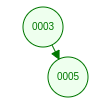
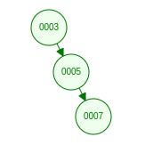
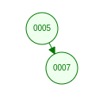

## Brute force solution

This is definitely the simplest way to solve it but the most inefficient. We can simply create a nested `for loop` and check each value in the array against every other value
in the array. At each iteration we check if:
1. The two values have indexes that have an absolute difference between them that are at most k
2. The two values themselves have an absolute difference between them that are at most t

```java
class Solution {
    public boolean containsNearbyAlmostDuplicate(int[] nums, int k, int t) {
        for (int i = 0; i < nums.length; i++) {
            for (int j = i + 1;  j < nums.length; j++) {
                if ( ( Math.abs((long) nums[i] - nums[j]) <= t) && (j - i <= k) ) {
                    return true;
                }
            }
        }
        return false;
    }
}
```

Note we can optimize this a bit by not looping over the **entire** array. Instead, we can start form i + 1 because we already tested the abs() value earlier.
(Math.abs(nums[i] - nums[j] ) is the same as Math.abs(nums[j] - nums[i] )) And we do `i + 1` because we want to exclude `i` itself since the index must be distinct.
However, this still results in O(n^2). 
We can do much better with the next solution.


## Sliding window solution

We will keep a small window of size k and check those k elements if there contains the correct value. 
The elements will be stored in a BST for O(log k) lookup.

We will maintain a binary search tree that never exceeds the value of k (our sliding window).
A BST has a search complexity of log k where k is the total number of nodes in the BST.


Summary of what we will do:
We will loop over the array and check all the values, that have an index that is within `k` indexes from the current index, if any of those values have an 
absolute difference from the current value that is `<= t` we will `return true`.

For each value in the array we do the following:
1) Get the closest value that is smaller than this current value. So in the above tree treeSet.floor(val) would return 9
2) Get the closest value that is larger than this current value. So in the above tree treeSet.floor(val) would return 12

This essentially searches in both directions of the array. Remember, we are only searching within the `k` bound. Our tree will **never** exceed k nodes. Because we only
want to look at values to the left and right of the current value if those values have an `index <= k`.

If there is a value in the treeSet that has an absolute difference from current value that is `<= t` then we return true. Because, again, we already know that all the values in the BST are within `k` distance.
If there does not exist a value in the treeSet that has an absolute difference from current value that is `<= t` then we add this current element to the `treeSet`
Then we adjust our sliding window to make sure our `treeSet` does not exceed `k`. Remove the furthest element if it does exceed `k`.


Let's take an example and walk through it:
```
Input: nums = [3,5,7,8], k = 2, t = 1
Output: true
```

We begin looping through the array and set `val` to 3. Since there are no values in the `treeSet`, `ceil` and `floor` are both `null`.
So we add 3 into `treeSet` and continue the loop.

Our `treeSet` currently looks like this:
 
 
 

Now `val` is 5. `floor` is 3 and `ceil` is `null` Since `5 - 3 is 2` this is not `<= t` so we add 5 to `treeSet` and continue.

Our `treeSet` currently looks like this:
 
 
 
now `val` is 7. `floor` is 5 and `ceil` is `null`. Again, since this does not result in ` <= t` we add 7 to `treeSet` and continue
Our `treeSet` currently looks like this:

 
 
Notice that our `treeSet` is larger than `k`! So we **remove** the `i - k` element, or the oldest added one.
Our updated `treeSet` currently looks like this:


 
now `val` is 8. `floor` is 7 and `ceil` is again `null`. Since `8 - 7 is 1` this is `<= t` so we `return true` and we're done.


note we don't need to use Math.abs like in the brute force solution. This is because with `floor` we are getting the value that is the closest value
 to nums[i] that is still smaller than nums[i]. Therefore, we know that it will not return a negative since we will do (nums[i] - floor). The 
 same applies just in reverse when checking if (ceil - nums[i]) is in the BST.
 

```java
class Solution {
        public static boolean containsNearbyAlmostDuplicate(int[] nums, int k, int t) {

            if(nums == null || nums.length < 2 || k < 1) return false;  // this is basic check to make sure input is valid.

            TreeSet<Long> treeSet = new TreeSet<>();

            for(int i = 0; i < nums.length; i++){
                long val = nums[i];     // cast to long because out TreeSet is of type Long.

                Long floor = treeSet.floor(val);
                Long ceil = treeSet.ceiling(val);

                if( (floor != null && val - floor <= t) || (ceil != null && ceil - val <= t) )
                    return true;

                treeSet.add(val);

                if(i >= k)
                    treeSet.remove((long)nums[i - k]);  // remember to cast to long.
            }
            return false;
        }
}
```

 So this is O(n log k) because we are (maybe) going through the entire array and for each val in the array we do a BST lookup which is O(log k) 
 so this results in O(n log k). 
 
 
O(n log k) is certainly better than O(n^2), however, can we do better? Well, yes. We can solve this in O(n) using Buckets.